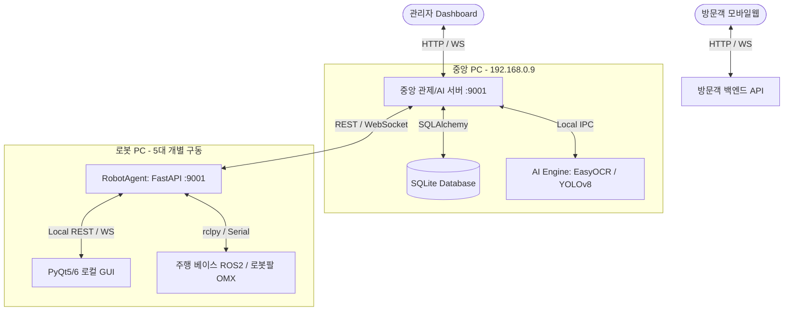

# 📚 무인 도서관 로봇 협업 관제 시스템 (LibraryPing)

본 프로젝트는 무인 도서관 내 야간 경비(침입 감지/녹화/신고) 및 서가 정리정돈(오배가 도서 탐지 및 재배치)을 수행하는 멀티 로봇 관제 시스템입니다.  
중앙 PC(AI/FMS 서버), 로봇 온보드 시스템(FastAPI + ROS2), 그리고 관리자 및 방문객용 웹/앱 클라이언트를 아우르는 **모노레포(Monorepo)** 구조로 설계되었습니다.

---

## 📂 폴더 구조 (Folder Structure)

루트 디렉토리의 전체 폴더 트리는 다음과 같은 구조로 나뉘어 배포 및 개발이 용이하도록 구성되어 있습니다.

```text
bot_ai_server/ (Root Git Repo)
├── central_server/                 # [중앙 PC용] 중앙 관제 및 AI 연산 엔진
│   ├── backend/                    # 관제/AI 통합 API 서버 (FastAPI, 포트 9001)
│   │                               # (DB 스키마 관리, FMS 통합 라우팅, AI 호출 중계)
│   ├── frontend/                   # 관리자 대시보드 웹 GUI (Vite + React, 포트 9002)
│   └── yolov8/                     # 객체/도서/침입 감지용 AI 모델 및 스크립트 (YOLOv8, EasyOCR)
│
├── mobile_web/                     # [신규 - 중앙 PC/클라우드 배포] 도서관 방문객 모바일 서비스
│   ├── backend/                    # 방문객 모바일웹 전용 백엔드 API (FastAPI)
│   └── frontend/                   # 방문객 모바일웹 프론트엔드 (React.js + Vite)
│
├── robot_agent/                    # [로봇 PC용] 경량 하드웨어 제어 및 ROS2 브릿지 에이전트
│   ├── app/                        # 에이전트 핵심 로직 (API 라우터, ROS2 노드, 하드웨어 드라이버)
│   ├── main.py                     # 에이전트 실행 진입점 (FastAPI 구동)
│   ├── requirements.txt            # 공통 종속성 패키지
│   ├── requirements-arm.txt        # 로봇팔(JetCobot, Dynamixel) 전용 패키지 (pymycobot 등)
│   └── requirements-driving.txt    # 주행로봇(Pinky) 전용 패키지 (ROS2 rclpy, opencv 등)
│
├── desktop_gui/                    # [로봇 PC용] 로봇 터치스크린 수동 조작 GUI
│   ├── main.py                     # PyQt GUI 실행 진입점 (로컬 화면에 창 표시)
│   ├── ui/                         # Qt Designer UI 및 이미지 리소스 (.ui 등)
│   └── app/                        # 로컬 에이전트(127.0.0.1:9001) 통신 클라이언트 및 위젯
│
└── docs/                           # 설계 및 시나리오 문서 폴더
```

---

## 🖥️ 시스템 아키텍처 및 역할 분담

중앙 서버의 부하 분산과 다수의 이기종 로봇의 안정적인 협업을 위해 시스템 역할을 완전히 **이원화**하였습니다.



### 1. 물리적 구동 위치 및 포트 정의
| 구성 요소 | 구동 하드웨어 | 주요 역할 | 포트 및 통신 프로토콜 |
| :--- | :--- | :--- | :--- |
| **Central Backend** | 중앙 AI PC | 전체 로봇 상태 관리 (FMS), 데이터베이스 제어, 웹 클라이언트 중계 | `9001` (FastAPI) |
| **Central Frontend** | 중앙 AI PC | 관리자용 실시간 모니터링 및 시나리오 제어 대시보드 | `9002` (Vite + React) |
| **Visitor Web** | 중앙 AI/클라우드 PC | 방문객용 도서 검색, 로봇 호출, 실시간 이용 안내 | (React + FastAPI) |
| **Robot Agent** | 로봇 내부 SBC (5대) | 실시간 주행 제어, 로봇팔 구동, 카메라 캡처 및 비디오 스트리밍 | `9001` (FastAPI) |
| **Desktop GUI** | 로봇 내부 SBC | 로봇 물리 화면에 탑재되는 터치스크린 기반 수동 조작 화면 | `127.0.0.1:9001` (PyQt) |

> [!NOTE]  
> 실시간 로그와 로봇의 하트비트가 5대에서 동시 유입될 때 발생할 수 있는 SQLite의 쓰기 락(`database is locked`) 문제를 예방하기 위해, **WAL 모드(Write-Ahead Logging)**를 활성화(`PRAGMA journal_mode=WAL`)하여 동시성 성능을 높입니다.

---

## 🤖 핵심 소프트웨어 제어 패턴

### 1. FSM & BT (행동 트리) 이중 제어 구조
로봇 에이전트는 복잡한 비즈니스 시나리오를 효과적으로 소화하기 위해 **상위 상태 제어(FSM)**와 **하위 실행 매뉴얼(Behavior Tree)**을 결합한 2계층 제어 모델을 사용합니다.

*   **FSM (유한 상태 기계)**: "현재 로봇이 어떤 모드인가?"를 나타내는 최상위 개념 (예: `IDLE`, `PATROL`, `INTRUSION_ALERT`, `ORGANIZING`)
*   **BT (행동 트리)**: "해당 모드일 때 구체적으로 어떤 단계를 거쳐 행동할 것인가?"를 수행하는 구체적 매뉴얼 (예: `BT_patrol_main`, `BT_intrusion_main`)

#### 💡 쉽게 이해하는 "관리자 - 스위치 - 행동 대본" 비유
1.  **Reconciler (관리자)**  
    로봇 내의 컨트롤 매니저입니다. "현재 모드"와 중앙 서버가 지시한 "목표 모드"를 항상 비교하며, 다른 점이 있으면 알맞은 스위치를 눌러 조정합니다.
2.  **fsm.trigger (스위치 조작)**  
    관리자가 상황에 따라 상태 전환 스위치(`patrol_request`, `intrusion` 등)를 누릅니다.  
    *   **대기 ➡️ 순찰**: `IDLE ➡️ PATROL` 로 스위치가 전환됩니다.
    *   **순찰 중 침입 감지**: `PATROL ➡️ INTRUSION_ALERT` 로 스위치가 급격히 전환됩니다.
3.  **BT 교체 (행동 대본 바꾸기)**  
    스위치가 바뀌면 로봇은 품속에서 그에 맞는 **행동 대본(BT)**을 꺼내 듭니다.
    *   `PATROL` 모드가 되면 **[순찰 대본(BT_patrol_main)]**을 들고 "특정 위치 이동 ➡️ 카메라로 살피기"를 반복합니다.
    *   `INTRUSION_ALERT` 모드가 되면 **[침입 대본(BT_intrusion_main)]**으로 신속하게 대본을 갈아 끼우고 "경고 방송 송출 ➡️ 침입자 추적 및 실시간 녹화"를 즉시 실행합니다.
    *   상황이 정리되면 다시 **[순찰 대본(BT_patrol_main)]**으로 되돌아갑니다.

---

### 2. FastAPI와 ROS2의 동거 (Onboard Agent)
로봇 PC 내에서 웹 통신을 처리하는 FastAPI와 실제 모터 제어를 위해 실시간으로 메시지를 통신하는 ROS2(`rclpy`)를 한 프로세스 내에서 효율적으로 구동합니다.

*   **이벤트 루프 분리**: 웹 요청을 처리하는 `asyncio` 메인 스레드와, ROS2 메시지를 구독/발행하는 `rclpy.spin` 스레드를 독립적으로 격리 구동합니다.
*   **느슨한 연결 (Decoupling)**: 웹 API 핸들러가 ROS2 노드를 직접 호출하지 않고, 내부 브릿지(`bridge.py`) 모듈과 스레드-안전(Thread-Safe)한 `Queue` 또는 `Lock`을 경유하여 통신합니다.  
    *   *이점*: 시스템 규모 확장이 필요할 경우, 코드 수정 없이 프로세스를 손쉽게 물리적으로 분리할 수 있습니다.

---

## 🔄 데이터 흐름 및 메시지 규칙

명령이 각 단계를 거쳐 전달되거나 결과가 위로 전송될 때, 한 단계(Hop)씩 거치며 역할과 이름이 바뀝니다.

```text
[요청 하강]
Admin/사용자 ➡️ 모드 변경 요청 (한글: '순찰', '정리') 
              ➡️ 중앙 서버 (목표 target_state 변환: 'PATROL') 
              ➡️ 로봇 에이전트 구동 명령 (command)

[응답 상승]
로봇 제어부 ➡️ 즉시 수락 여부 응답 (accepted: true/false) ➡️ 중앙 서버 (Relay) ➡️ 브라우저 Push
로봇 실행부 ➡️ 비동기 진행 상태 보고 (State Report: 'PATROL') ➡️ 중앙 서버 (Push)  ➡️ 브라우저 UI 한글 매핑 ('순찰 중')
```

### 🚨 실패 및 예외 처리 가이드 (Alt Scenario)
1.  **목표 지점 이동 실패**: 주행 중 장애물 등으로 목적지에 도달하지 못할 경우, 즉시 `move_failed` 이벤트를 발생시키고 에이전트 FSM 상태를 `IDLE`로 롤백하며, 중앙 FMS에 알람을 푸시합니다.
2.  **로봇팔(Arm) 파지 실패**: 책을 집어 올리거나 위치를 변경할 때 토크(Torque) 모니터링 값 이상이나 센서 감지가 끊어질 경우, `pick_failed` 이벤트를 트리거하여 로봇 동작을 중단하고 수동 조작 GUI(`desktop_gui`)로 제어권을 즉각 양도합니다.
3.  **네트워크 단절(Disconnected)**: 중앙 서버와 로봇 에이전트 간의 WebSocket 연결이 유실될 경우, 로봇 에이전트는 즉시 안전 모드(Safe Mode)로 진입하여 동작을 멈추고 현 위치에서 통신 재연결을 주기적으로 시도합니다.
