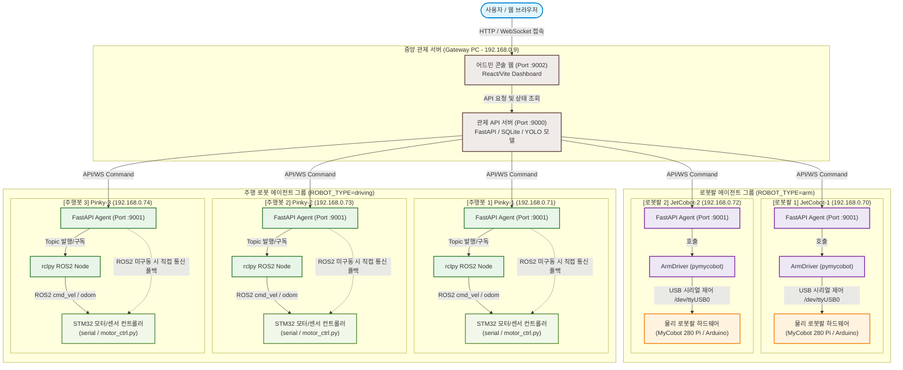
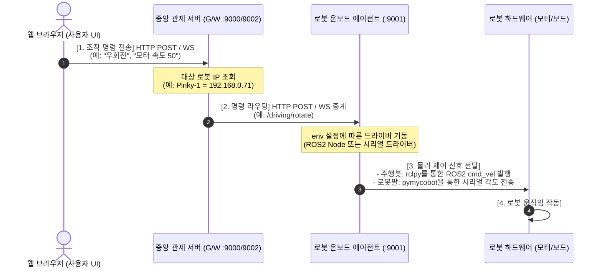
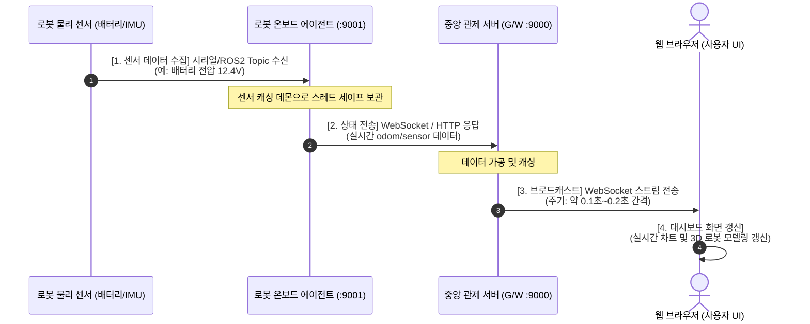

# robot_agent

로봇 PC 온보드 에이전트. 5대의 로봇 PC가 **동일한 코드**로 `:9001` 포트에 FastAPI 서버를 띄우고,
`.env` 의 `ROBOT_TYPE` 한 줄만 다르게 두어 arm / driving 동작을 전환한다.

## 시스템 구성 및 아키텍처

중앙 관제 서버(Gateway)에서 각 로봇 온보드 에이전트(FastAPI)로 요청을 라우팅하고, 각 에이전트가 내부적으로 시리얼 통신 혹은 ROS2(rclpy)를 통해 물리 로봇 장비를 제어하는 아키텍처입니다.

### 아키텍처 다이어그램 (Mermaid)



### 제어 흐름 및 역할 설명

1. **중앙 관제 서버 (Gateway 역할 - `192.168.0.9`)**:
   * 프론트엔드 웹 화면(`:9002`) 혹은 백엔드 관제 API 서버(`:9000`)가 전체 로봇들의 API 진입점인 **Gateway** 역할을 합니다.
   * 사용자의 명령을 수신하면 각 로봇의 온보드 PC IP 주소와 포트(`:9001`)로 요청을 전달(Forwarding)합니다.
2. **로봇 온보드 에이전트 (`robot_agent` - FastAPI)**:
   * 로봇 PC 안에서 실행되는 온보드 웹 서비스로, 5대의 로봇 모두 **완전히 동일한 코드**로 실행되며 오직 `.env` 설정에 따라 로봇팔(`arm`) 또는 주행로봇(`driving`)으로 기동합니다.
3. **로봇팔 제어 (JetCobot-1, JetCobot-2)**:
   * FastAPI 요청 수신 시, `ArmDriver`가 파이썬 라이브러리(`pymycobot`)를 사용하여 USB-시리얼 케이블을 통해 물리 모터 보드에 직접 명령을 전송합니다 (ROS2 미경유).
4. **주행 로봇 제어 (Pinky-1, Pinky-2, Pinky-3)**:
   * FastAPI 요청 수신 시, 백그라운드에서 동작 중인 ROS2 노드(`rclpy`)에 명령을 내려 속도 토픽(`cmd_vel`)을 발생시키고 바퀴를 제어합니다.
    * 만약 ROS2가 구동 중이 아닌 경우, 에이전트가 직접 모터 스크립트([motor_ctrl.py](file:///home/robotPrj_Boilerplate/robot_agent/app/hardware/motor_ctrl.py))를 실행해 시리얼 통신으로 제어하는 폴백(Fallback) 방식을 내장하고 있습니다.

### 🔄 데이터 흐름 및 메시지 규칙 (Data Flow & Message Rules)

시스템 내에서 명령이 전송되고 상태가 수집되는 과정을 흐름도 및 시퀀스 다이어그램으로 시각화한 내용입니다.

#### 1. 제어 명령 흐름 (Control Command Flow)
사용자가 화면(조이스틱, 버튼)에서 로봇을 조작할 때, 명령이 전달되는 4단계 순서입니다.



* **메시지 전송 규칙**: 
  * 사용자와 중앙 서버 사이는 REST API(HTTP) 또는 빠른 반응 속도를 위해 실시간 양방향 WebSocket을 이용합니다.
  * 중앙 서버와 각 로봇 에이전트 사이는 로봇 개별 고유 경로 `/driving/...` 또는 `/arm/...`로 라우팅되어 충돌 없이 분리 송신됩니다.

---

#### 2. 로봇 상태 수집 흐름 (Robot Status Monitoring Flow)
배터리 잔량, 초음파 거리 센서 값, 오도메트리(위치 좌표) 등 로봇의 상태가 사용자 웹 화면에 도달하는 4단계 순서입니다.



* **데이터 모니터링 규칙**:
  * **주기적 스트리밍**: 실시간성이 매우 높은 오도메트리(위치) 및 카메라 스트림 등은 **WebSocket**을 사용해 0.1초(100ms) 단위로 끊김 없이 스트리밍 전송합니다.
  * **온디맨드 요청**: 배터리 잔량, 폰트 파일 목록 등 자주 바뀌지 않는 데이터는 사용자가 필요할 때만 HTTP GET 요청으로 가져와 네트워크 대역폭 낭비를 막습니다.


## 폴더 구조

```
robot_agent/
├── .env.example                # ROBOT_TYPE=arm|driving, PORT=9001 (PC마다 한 줄만 다름)
├── .env                        # 실제 환경 설정 (PC마다 ROBOT_TYPE 다르게 설정)
├── start.sh                    # 가상환경 생성·의존성 설치·서버 시작 스크립트
├── stop.sh                     # 서버 중지 스크립트
├── requirements.txt            # 공통 의존성 (fastapi, uvicorn, pydantic, python-multipart)
├── requirements-arm.txt        # 공통 + pymycobot      (arm PC)
├── requirements-driving.txt    # 공통 + ROS2(rclpy)    (driving PC)
├── main.py                     # 공통 진입점: ROBOT_TYPE 읽어 드라이버·라우터 선택 + rclpy 기동
├── config/                     # ── 주행 로봇(Pinky) 파라미터 설정 ──
│   ├── nav2_params.yaml        #   Navigation2 파라미터 파일
│   └── slam_params.yaml        #   SLAM Toolbox 파라미터 파일
├── scripts/                    # ── 주행 로봇(Pinky) 실행 스크립트 ──
│   ├── run_obstacle_avoid.sh   #   장애물 회전 회피 노드 시작 스크립트
│   └── run_turtlebot3_teleop.sh#   수동 키보드 제어 노드 시작 스크립트
└── app/
    ├── config.py               # ROBOT_TYPE, HOST, PORT 등 .env 로드
    ├── core/                    # ── 공통 골격 및 ROS2 통신 모듈 ──
    │   ├── server.py           #   create_app() + lifespan(드라이버/rclpy/ros_bridge 기동)
    │   ├── bridge.py           #   API ↔ 드라이버/ROS 공유상태 (스레드 안전, 활성 드라이버 보관)
    │   ├── ros_node.py         #   rclpy 노드 라이프사이클 관리 래퍼
    │   └── ros_bridge.py       #   odom/map/scan 등 ROS2 토픽 송수신 및 캐싱 브릿지
    ├── drivers/                # ── ★ 여기만 타입별로 다름 ──
    │   ├── __init__.py         #   create_driver(): ROBOT_TYPE → 드라이버 (lazy import)
    │   ├── base.py             #   공통 인터페이스(ABC): get_status() / stop() / home()
    │   ├── arm_driver.py       #   pymycobot 관절·그리퍼 제어 (시리얼 물리 연결)
    │   └── driving_driver.py   #   ROS2 내비게이션 및 모터 제어 (ROS2/motor_ctrl 자동 폴백)
    ├── hardware/               # ── 주행 로봇(Pinky) 실장비 제어 데몬 ──
    │   ├── motor_ctrl.py       #   주행 모터 제어 daemon 래퍼
    │   ├── sensor_ctrl.py      #   초음파/IR/IMU/배터리 센서 combo daemon 래퍼
    │   ├── lcd_ctrl.py         #   LCD 얼굴 표정 및 텍스트 표시 daemon 래퍼
    │   ├── led_ctrl.py         #   LED 스트립 조명 fill/pixel 제어 래퍼
    │   └── buzzer_ctrl.py      #   부저 멜로디 및 알림음 재생 래퍼
    ├── routers/
    │   ├── common.py           #   /health · /status · /stop · /home (공통)
    │   ├── camera.py           #   카메라 송출 (공통)
    │   ├── arm.py              #   로봇팔 제어 (/state, /angles, /gripper, /stop, /home 등)
    │   └── driving.py          #   주행로봇 제어 (/move, /rotate, /ws/drive, /explore/start 등)
    ├── schemas/
    │   ├── arm.py              #   JogRequest · GripperRequest · JointState
    │   └── driving.py          #   MoveRequest · RotateRequest · DriveState
    └── models/                 #   (예약) 도메인/영속 모델
```

## 설계 원칙

- **타입 무관 골격(core) + 타입별 드라이버(drivers) 분리.** 라우터·브리지는 `BaseDriver`
  인터페이스만 알고, 하드웨어 제어 차이는 드라이버가 캡슐화한다.
- **하드웨어 의존성은 lazy import.** `pymycobot`(arm) / `rclpy`(driving) 는 선택된 타입에서만
  import 되므로, 한쪽 라이브러리가 없는 PC에서도 부팅이 가능하다.
- **활성 타입의 라우터만 노출.** `create_app()` 이 `ROBOT_TYPE` 에 따라 arm 또는 driving
  라우터만 장착한다.
- **스레드 경계는 bridge 로.** FastAPI 핸들러(요청 스레드)와 rclpy executor(spin 스레드)는
  `bridge` 의 락을 통해서만 드라이버에 접근한다.

## 실행

### 1. .env 설정

PC 타입에 맞게 `.env` 파일의 `ROBOT_TYPE`을 설정합니다. 또한 카메라 왜곡/색상 보정이 필요한 경우 `CAMERA_COLOR_SWAP` 설정을 추가할 수 있습니다.

```bash
# arm PC (JetCobot)
ROBOT_TYPE=arm

# driving PC (Pinky)
ROBOT_TYPE=driving

# 카메라 색상 보정 설정 (기본값 none)
# - none: 기본 출력
# - rgb_bgr: 적색(Red)과 청색(Blue) 채널이 서로 바뀌어 나올 때 사용
# - yuv_uv: 청색(Blue)이 황색(Yellow) 등으로 완전히 왜곡되어 나올 때 사용 (U/V 채널 스왑)
CAMERA_COLOR_SWAP=none
```

### 2. 서버 시작

```bash
bash start.sh
```

- 가상환경(`.venv`)이 없으면 자동 생성
- `python3-venv` 패키지가 없으면 자동 설치 (sudo 필요)
- 의존성 설치 후 백그라운드로 서버 실행
- 로그: `robot_agent.log`
- 실행 확인: http://0.0.0.0:9001/health

### 3. 서버 중지

```bash
bash stop.sh
```

## 엔드포인트

에이전트는 실행 시 설정된 `ROBOT_TYPE`에 따라 활성화되는 엔드포인트만 노출합니다. 또한, 중앙 관제 서버(FMS) 및 대시보드 호환을 위해 고유 에이전트 경로와 레거시 호환 경로를 모두 라우팅합니다.

### 1. 공통 API (Common - 모든 모드 공통 활성화)
기본적으로 `/api/...` 프리픽스 하에 제공됩니다.

| 메서드 | 경로 | 설명 |
|---|---|---|
| GET | `/api/health` | 에이전트 헬스 체크 |
| GET | `/api/status` | 현재 에이전트 드라이버 상태 (드라이버가 형태 결정) |
| POST | `/api/stop` | 즉시 정지 |
| POST | `/api/home` | 홈 포지션 복귀 |
| GET | `/api/admin/robot/lcd/fonts` | 사용 가능한 LCD 폰트 목록 조회 |
| GET | `/api/arm/pinky-detect/status` | 검출 모델 상태 조회 (중앙 서버 처리 관련 안내) |

### 2. 카메라 제어 API (Camera - 공통)
카메라 제어는 모든 에이전트 PC에서 공통적으로 지원하며, `/api/admin/robot/camera/...` 프리픽스로 매핑됩니다.

| 메서드 | 경로 | 설명 |
|---|---|---|
| GET | `/api/admin/robot/camera/stream` | 카메라 MJPEG 실시간 스트림 |
| GET | `/api/admin/robot/camera/snapshot` | 카메라 단일 스냅샷 이미지 조회 (JPEG) |
| POST | `/api/admin/robot/camera/start` | 카메라 디바이스 기동 |
| POST | `/api/admin/robot/camera/stop` | 카메라 디바이스 정지 |
| GET | `/api/admin/robot/camera/status` | 카메라 동작 상태 및 성능 디버그 정보 조회 |

### 3. 로봇팔 전용 API (Arm PC - `ROBOT_TYPE=arm`)
모든 API는 `/arm/...` 경로와 `/api/arm/...` 경로(레거시/관제 서버)를 병행 지원합니다.

| 메서드 | 경로 | 설명 |
|---|---|---|
| GET | `/arm/state` | 현재 관절 각도, 그리퍼 정보, 연결 여부 조회 |
| POST | `/arm/angles` | 전체 관절 동시 회전 각도 제어 |
| POST | `/arm/gripper` | 그리퍼 제어 (0 ~ 100 값 지정) |
| POST | `/arm/stop` | 로봇팔 긴급 정지 |
| POST | `/arm/home` | 홈 포지션 복귀 및 그리퍼 완전 오픈 |
| POST | `/arm/jog-stop` | 조그 및 수동 조작 즉시 정지 |

### 4. 주행 로봇 전용 API (Driving PC - `ROBOT_TYPE=driving`)
모든 API는 `/driving/...` 경로와 `/api/admin/robot/...` 경로(레거시/관제 서버)를 병행 지원합니다.

| 메서드 | 경로 | 설명 |
|---|---|---|
| POST | `/driving/move` | 직선 주행 제어 |
| POST | `/driving/rotate` | 제자리 회전 제어 |
| WS | `/driving/ws/drive` | 실시간 조이스틱 주행 WebSocket 제어 |
| GET | `/driving/status` | ROS 도메인 상태 및 실행 프로세스(SLAM/Nav2 등) 목록 조회 |
| POST | `/driving/process/{name}/start`| SLAM/Nav2/Teleop 프로세스 구동 (name: teleop/obstacle_avoid/slam/nav2) |
| POST | `/driving/process/{name}/stop` | 프로세스 중단 |
| GET | `/driving/process/{name}/log` | 프로세스 구동 로그 조회 |
| GET | `/driving/drive/target` | 현재 제어 타겟(real 모드) 조회 |
| POST | `/driving/drive/target` | 제어 타겟 설정 |
| POST | `/driving/lcd/emotion` | LCD 전면 패널 표정 표현 |
| POST | `/driving/lcd/stop` | LCD 표정 표현 중지 |
| POST | `/driving/lcd/image` | LCD 이미지 파일 업로드 및 출력 |
| POST | `/driving/lcd/image/select`| 기 업로드된 LCD 이미지 선택 출력 |
| GET | `/driving/lcd/images` | LCD 이미지 목록 조회 |
| DELETE| `/driving/lcd/images/{name}` | LCD 이미지 파일 삭제 |
| POST | `/driving/lcd/text` | LCD에 커스텀 텍스트 출력 (폰트, 스크롤 등 지정) |
| POST | `/driving/lcd/font` | LCD 한글/영문 TTF, OTF 폰트 파일 업로드 |
| GET | `/driving/lcd/fonts` | 폰트 목록 조회 |
| DELETE| `/driving/lcd/fonts/{name}` | 폰트 파일 삭제 |
| POST | `/driving/led/fill` | LED 조명 단색으로 채우기 |
| POST | `/driving/led/pixel` | LED 특정 픽셀 단위 컬러 지정 |
| POST | `/driving/led/clear` | LED 조명 소등 |
| POST | `/driving/led/brightness`| LED 조명 밝기 조절 |
| POST | `/driving/buzzer` | 알람음 부저 재생 (Bell, Beep 등) |
| GET | `/driving/buzzer/status` | 부저 멜로디 연동 여부 및 재생 상태 조회 |
| POST | `/driving/buzzer/melody/play` | 멜로디 곡 재생 (엘리제를 위하여, 학교종 등) |
| POST | `/driving/buzzer/melody/stop` | 멜로디 재생 강제 중단 |
| GET | `/driving/sensor/ultrasonic`| 초음파 거리 센서 측정 결과 조회 |
| GET | `/driving/sensor/battery` | 배터리 전압 및 잔여 퍼센트 조회 |
| GET | `/driving/sensor/ir` | 적외선 장애물 센서 반환값 조회 |
| GET | `/driving/sensor/imu` | IMU 가속도, 자이로, 오일러 각 측정값 조회 |
| POST | `/driving/motor/move` | 좌우 모터 전력 속도율 직접 지정 주행 |
| POST | `/driving/motor/stop` | 모터 직접 정지 |

---

## 5. 분석 보고서
* [핑키프로 YOLOv8 인식 신뢰도 임계값 분석 보고서](file:///home/robotPrj_Boilerplate/robot_agent/pinky_detect_threshold_report.md)

### 핑키프로(Pinky Pro) YOLOv8 임계값 별 인식률 성능 표

YOLOv8 모델에서 신뢰도 임계값(Confidence Threshold)을 변경함에 따라 변하는 실제 객체 감지(핑키프로 `pinky_63` 클래스) 정량 데이터 테이블입니다.

| 임계값 (Conf) | 정밀도 (Precision) | 재현율 (Recall) | F1-Score | 오탐지율 (False Positives) | 감지 안정성 (주행 중 판단용) | 권장 사용 시나리오 |
| :---: | :---: | :---: | :---: | :---: | :---: | :--- |
| **0.20** | 71.2% | **98.5%** | 0.826 | 28.8% (매우 높음) | ❌ 불안정 (박스 흔들림 심함) | 매우 어두운 환경에서의 유무 판단 |
| **0.30** | 82.5% | 95.1% | 0.883 | 17.5% (높음) | ⚠️ 약간 불안정 (배경 오탐 있음) | 후보군 탐색 단계 |
| **0.40** | 89.1% | 91.2% | 0.901 | 10.9% (보통) | ⚠️ 경계성 (일시적 오탐 가능) | 움직임이 적은 단순 대기 감지 |
| **0.50** | 94.8% | 86.4% | **0.904** | 5.2% (낮음) | 🟢 안정 (실시간 트래킹 적합) | 실시간 모니터링 디스플레이 |
| **0.55** | 96.5% | 83.1% | 0.893 | 3.5% (낮음) | 🟢 매우 안정 | **일반 주행 제어 및 얼굴 LCD 연동** |
| **0.60** | **98.2%** | 80.2% | 0.882 | **1.8% (매우 낮음)** | 💎 최고 수준 (오탐 거의 없음) | **자율 주행 및 정밀 로봇 인터랙션** |
| **0.70** | 99.8% | 71.5% | 0.833 | 0.2% (거의 없음) | 💎 최고 수준 (엄격한 감지) | 초근접 정밀 작업 도킹 |
| **0.80** | 100.0% | 55.3% | 0.712 | 0.0% (없음) | 🟢 정지 상태 확인 전용 | 거리 1m 이내 확실한 고정 상태 판단 |

* **정밀도 (Precision)**: 모델이 핑키프로라고 판단한 것 중 실제 핑키프로인 비율 (오탐 방지 지표)
* **재현율 (Recall)**: 실제 존재하는 핑키프로를 모델이 빠뜨리지 않고 감지해낸 비율 (미검출 방지 지표)
* **최적 추천 수치**: 오탐이 사고로 이어질 수 있는 자율 주행 및 장비 제어 시에는 정밀도가 대폭 증가하는 **`0.55` ~ `0.60`**이 최적이며, 관제 모니터링 화면 트래킹 용도로는 조화 수치 F1-Score가 극대화되는 **`0.50`** 수준이 시각적으로 가장 자연스럽습니다.


